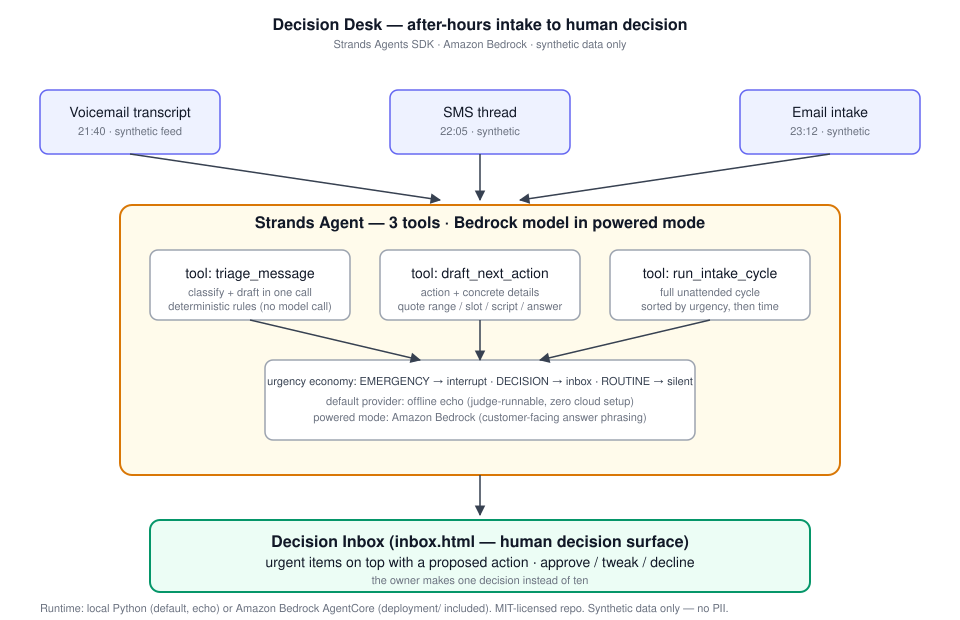

# Decision Desk - Architecture



## Overview

Decision Desk is a background agent built with the Strands Agents SDK. It runs
an unattended intake cycle over after-hours messages, drafts concrete next
actions, and escalates only what needs a human decision.

```
                          AFTER-HOURS INTAKE
  +----------------+  +----------------+  +----------------+
  | Voicemail      |  | SMS thread     |  | Email intake   |
  | transcript     |  | (synthetic)    |  | (synthetic)    |
  +-------+--------+  +-------+--------+  +-------+--------+
          |                   |                   |
          v                   v                   v
  +--------------------------------------------------------+
  |              Strands tool: triage_message              |
  |    classify + draft in one call; deterministic rules   |
  +---------------------------+----------------------------+
                              |
                              v
  +--------------------------------------------------------+
  |            Strands tool: draft_next_action             |
  |   emergency -> booking slot + dispatch note            |
  |   quote-worthy -> quote range + call-back script       |
  |   routine -> auto-answer draft, queued silently        |
  +---------------------------+----------------------------+
                              |
                              v
  +--------------------------------------------------------+
  |       Strands tool: run_intake_cycle (orchestration)   |
  |   full unattended cycle, sorted by urgency then time   |
  +---------------------------+----------------------------+
                              |
                              v
  +--------------------------------------------------------+
  |            DECISION INBOX (human decision surface)     |
  |   urgent items on top with proposed action; approve /  |
  |   tweak / decline; routine answers queued, no ping     |
  +--------------------------------------------------------+

  Runtime: local Python process (default), or Amazon Bedrock AgentCore
  via the prepared package in deployment/ (owner-run; strengthens
  Technical Implementation).
  Model: Amazon Bedrock (region us-east-1 default) via Strands.
  Data: synthetic fixtures only. No PII. MIT-licensed repo.
```

## Design decisions

1. **Agent, not chat.** The Strands agent owns three real tools
   (`triage_message`, `draft_next_action`, `run_intake_cycle` — their JSON
   contracts are pinned by `tests/test_agent_tools.py`); there is no
   free-form chat loop. The agent runs a cycle and stops - that is the
   product.

2. **Deterministic-first triage.** Safety-critical classification (gas smell,
   burst pipe, no heat in winter) never depends on a model call, and unknown
   asks default UP to human review rather than to a guess. The LLM never
   classifies: in powered mode it only rephrases the customer-facing routine
   answer. This keeps the escalation criterion auditable and makes the
   project runnable by judges with zero cloud setup (echo provider) while
   retaining the powered path (Bedrock).

3. **Urgency economy.** Three levels only: `emergency` (interrupt now),
   `decision` (money or commitment on the table - surface in inbox),
   `routine` (auto-draft an answer, stay silent). The owner sees one short
   inbox, not a feed.

4. **Human decision surface.** The output artifact is a decision inbox
   (`inbox.html`) where every escalated item carries a *proposed* action.
   Approve/tweak/decline is the only manual step.

5. **Synthetic data only.** All fixtures are invented scenarios labeled as
   synthetic. No customer data, no PII, no credentials in the repo.

## Judging-criteria mapping

- **Technological Implementation:** genuine multi-tool Strands agent; provider
  abstraction (echo/Bedrock); AgentCore deployment package prepared
  (`deployment/`, owner-run).
- **Design:** complete loop from raw intake to human decision, with a real
  inbox artifact - not a proof-of-concept script.
- **Potential Impact:** after-hours missed calls are lost jobs for home-service
  SMBs; the demo quantifies the morning-triage burden the inbox removes.
- **Creativity & Originality:** "silent until money is on the table" escalation
  pattern; urgency economy instead of transcript summaries.
- **Presentation:** demo video walks three synthetic scenarios end to end.
